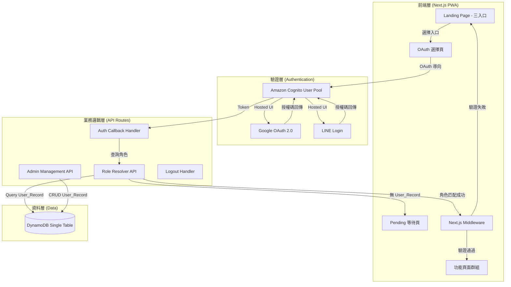
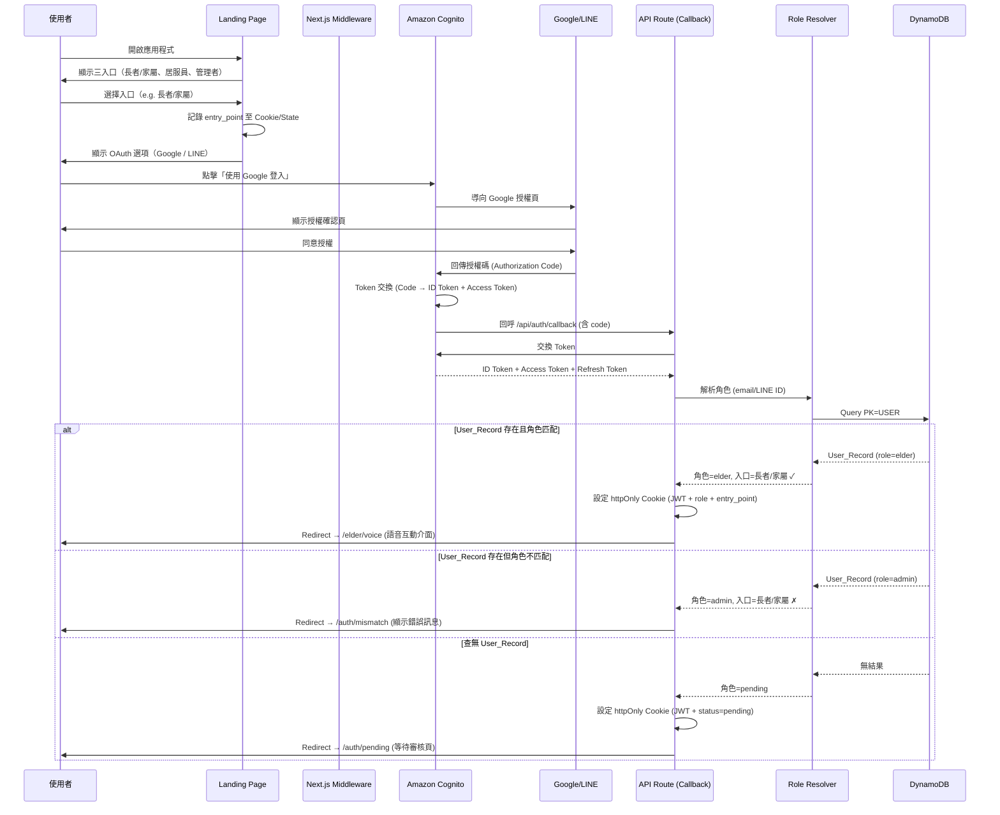
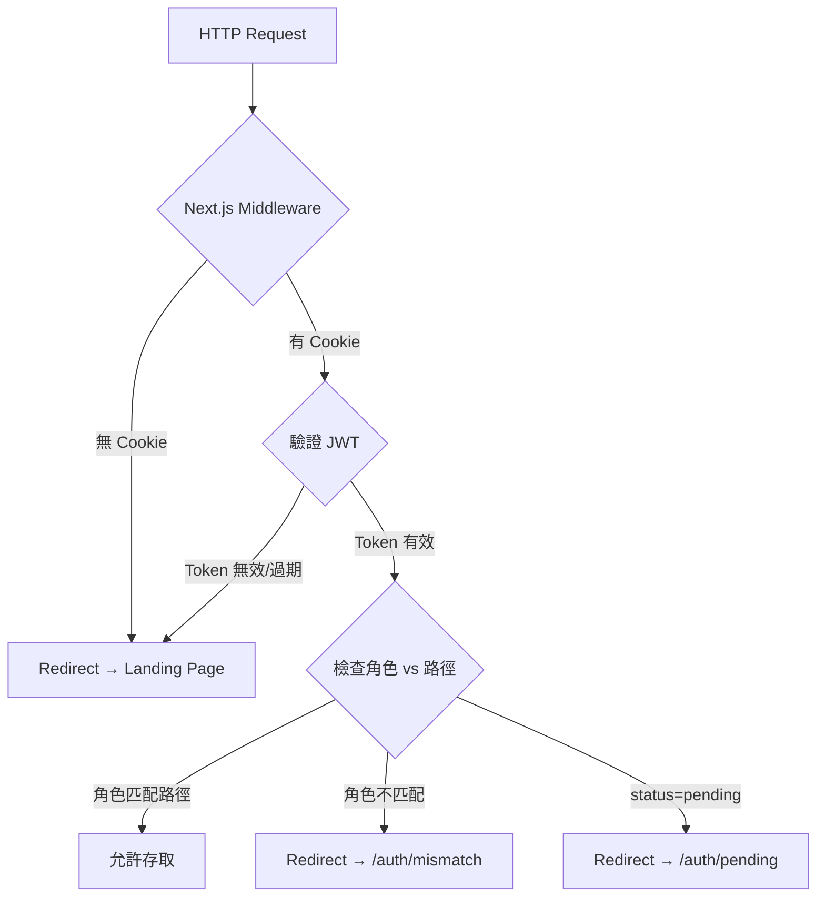

# 技術設計文件：角色式登入與導向系統

> **LEGACY／SUPERSEDED DESIGN（2026-08-14）**
>
> 本設計的 Cognito、DynamoDB Single-Table `User_Record`、OAuth-only 與固定 role-to-route mapping
> 不再是 canonical architecture。現行與 Target 決策見
> [ADR 0010](../../../docs/adr/0010-provider-neutral-oidc-and-application-sessions.md)、
> [ADR 0012](../../../docs/adr/0012-kinsun-owned-account-and-linked-authenticators.md)、
> [ADR 0013](../../../docs/adr/0013-separate-account-elder-enrollment-entitlement.md) 及
> [Spec 17](../../../docs/spec/17智慧長照%20AI%20陪伴系統－Account、Elder、Enrollment%20與%20Service%20Entitlement%20v0.1.md)。
> Elder 可以無帳號，由授權 Staff／Family／Device 建立受控 Elder Session；前端路由不得只靠
> `elder` role 或 client entry point 授權。本文只作歷史參考。

## 概述（Overview）

角色式登入與導向系統是智慧長照 AI 陪伴系統的身份驗證與授權入口模組。系統採用 Next.js App Router (PWA) 作為前端框架，整合 Amazon Cognito User Pool 支援 Google 與 LINE 聯合身分供應商進行 OAuth 2.0 驗證，並透過 DynamoDB Single-Table Design 儲存使用者角色對應關係，實現角色解析與頁面導向。

### 設計目標

- **簡潔直覺的登入體驗**：三入口設計讓不同角色使用者快速辨識
- **零密碼管理負擔**：完全依賴 OAuth 社群帳號登入
- **安全的角色隔離**：透過 Next.js Middleware 在 Edge 層執行路由保護
- **適老化設計**：大按鈕、高對比、無障礙操作
- **與主系統共用資料層**：使用同一張 DynamoDB 表，遵循 Single-Table Design

### 技術選型決策

| 決策項目 | 選擇 | 理由 |
|---------|------|------|
| 前端框架 | Next.js 14+ App Router (PWA) | 與主系統一致，支援 Middleware、SSR |
| 身份驗證 | Amazon Cognito User Pool | 全託管 OAuth、支援多 IdP 整合 |
| OAuth 供應商 | Google、LINE | 臺灣長者/家屬最常用的社群帳號 |
| 資料庫 | DynamoDB (Single-Table) | 與主系統共用表，低延遲角色查詢 |
| Token 儲存 | httpOnly Cookie | 防止 XSS 竊取 Token |
| 路由保護 | Next.js Middleware (Edge Runtime) | 請求到達 Server 前即攔截未授權存取 |
| 狀態管理 | React Context + Server Components | 輕量級，不需額外狀態庫 |

## 架構（Architecture）

### 系統架構圖



### OAuth 登入流程時序圖



### 路由保護架構



## 元件與介面（Components and Interfaces）

### 1. 前端頁面元件

#### Landing Page Component

```typescript
// app/(public)/page.tsx
interface EntryPoint {
  id: 'elder-family' | 'caregiver' | 'admin';
  label: string;
  description: string;
  icon: React.ReactNode;
  variant: 'primary' | 'secondary';
  allowedRoles: UserRole[];
}

const ENTRY_POINTS: EntryPoint[] = [
  {
    id: 'elder-family',
    label: '長者／家屬',
    description: '語音陪伴與生活摘要',
    variant: 'primary',        // 最大尺寸、溫暖色調
    allowedRoles: ['elder', 'family'],
  },
  {
    id: 'caregiver',
    label: '居服員',
    description: '照護者儀表板',
    variant: 'secondary',
    allowedRoles: ['caregiver'],
  },
  {
    id: 'admin',
    label: '管理者',
    description: '系統管理後台',
    variant: 'secondary',
    allowedRoles: ['admin'],
  },
];
```

#### OAuth 選擇元件

```typescript
// app/(public)/auth/login/[entryPoint]/page.tsx
interface OAuthOption {
  provider: 'google' | 'line';
  label: string;
  icon: React.ReactNode;
  cognitoIdpName: string;  // Cognito 中的 IdP 名稱
}

const OAUTH_OPTIONS: OAuthOption[] = [
  {
    provider: 'google',
    label: '使用 Google 登入',
    cognitoIdpName: 'Google',
  },
  {
    provider: 'line',
    label: '使用 LINE 登入',
    cognitoIdpName: 'LINE',
  },
];
```

### 2. 驗證服務介面

#### Auth Service (API Routes)

```typescript
// lib/auth/types.ts
type UserRole = 'elder' | 'family' | 'caregiver' | 'admin';
type EntryPointId = 'elder-family' | 'caregiver' | 'admin';
type AuthStatus = 'authenticated' | 'pending' | 'mismatch' | 'unauthenticated';

interface AuthSession {
  userId: string;           // Cognito sub
  email?: string;
  lineId?: string;
  role: UserRole | null;    // null = pending
  entryPoint: EntryPointId;
  status: AuthStatus;
  expiresAt: number;        // Unix timestamp
  issuedAt: number;
}

interface CognitoTokens {
  idToken: string;
  accessToken: string;
  refreshToken: string;
  expiresIn: number;
}
```

#### Auth Callback Handler

```typescript
// app/api/auth/callback/route.ts
interface AuthCallbackRequest {
  code: string;             // Cognito 授權碼
  state: string;            // 含 entry_point 資訊的加密 state
}

interface AuthCallbackResponse {
  redirectUrl: string;      // 角色對應的目標頁面
}

// 角色到目標路由的映射
const ROLE_ROUTE_MAP: Record<UserRole, string> = {
  elder: '/elder/voice',
  family: '/family/summary',
  caregiver: '/caregiver/dashboard',
  admin: '/admin/panel',
};
```

#### Role Resolver

```typescript
// lib/auth/role-resolver.ts
interface RoleResolver {
  /**
   * 根據使用者識別資訊查詢 DynamoDB 中的角色
   * @returns UserRole 或 null（表示 pending）
   */
  resolveRole(identifier: UserIdentifier): Promise<RoleResolutionResult>;
}

interface UserIdentifier {
  email?: string;
  lineId?: string;
  cognitoSub: string;
}

interface RoleResolutionResult {
  found: boolean;
  role: UserRole | null;
  userId: string | null;
  status: 'active' | 'disabled' | 'not_found';
}

/**
 * 入口與角色對應關係定義
 */
const ENTRY_ROLE_MAPPING: Record<EntryPointId, UserRole[]> = {
  'elder-family': ['elder', 'family'],
  'caregiver': ['caregiver'],
  'admin': ['admin'],
};

/**
 * 驗證角色與入口是否匹配
 */
function isRoleEntryMatch(role: UserRole, entryPoint: EntryPointId): boolean {
  return ENTRY_ROLE_MAPPING[entryPoint].includes(role);
}
```

### 3. Next.js Middleware

```typescript
// middleware.ts
interface MiddlewareConfig {
  publicPaths: string[];         // 不需驗證的路徑
  pendingAllowedPaths: string[]; // pending 狀態允許的路徑
  rolePathRules: RolePathRule[];
}

interface RolePathRule {
  pathPrefix: string;
  allowedRoles: UserRole[];
}

const MIDDLEWARE_CONFIG: MiddlewareConfig = {
  publicPaths: [
    '/',                    // Landing Page
    '/auth/login',          // OAuth 選擇頁
    '/auth/mismatch',       // 不匹配錯誤頁
    '/api/auth/callback',   // OAuth Callback
    '/api/auth/logout',     // 登出 API
  ],
  pendingAllowedPaths: [
    '/auth/pending',        // 等待審核頁
    '/api/auth/logout',     // 允許登出
  ],
  rolePathRules: [
    { pathPrefix: '/elder', allowedRoles: ['elder'] },
    { pathPrefix: '/family', allowedRoles: ['family'] },
    { pathPrefix: '/caregiver', allowedRoles: ['caregiver'] },
    { pathPrefix: '/admin', allowedRoles: ['admin'] },
  ],
};
```

### 4. 管理者角色管理 API

```typescript
// app/api/admin/users/route.ts
interface CreateUserRequest {
  identifier: string;      // email 或 LINE ID
  identifierType: 'email' | 'line_id';
  role: UserRole;
  displayName: string;
  notes?: string;
}

interface UpdateUserRoleRequest {
  userId: string;
  newRole: UserRole;
  reason?: string;
}

interface DisableUserRequest {
  userId: string;
  reason: string;
}

interface UserListResponse {
  users: UserRecordDTO[];
  nextToken?: string;
  totalCount: number;
}

interface UserRecordDTO {
  userId: string;
  identifier: string;
  identifierType: 'email' | 'line_id';
  role: UserRole;
  status: 'active' | 'disabled';
  displayName: string;
  createdAt: string;
  updatedAt: string;
  lastLoginAt: string | null;
}
```

### 5. API 端點總覽

| 方法 | 路徑 | 說明 | 存取角色 |
|------|------|------|---------|
| GET | `/api/auth/login?entry={id}&provider={p}` | 產生 Cognito OAuth URL 並 Redirect | Public |
| GET | `/api/auth/callback` | OAuth 回呼處理 | Public |
| POST | `/api/auth/logout` | 登出並清除 Session | Authenticated |
| GET | `/api/auth/session` | 取得當前 Session 資訊 | Authenticated |
| GET | `/api/admin/users` | 列出所有 User_Record | Admin |
| POST | `/api/admin/users` | 建立 User_Record | Admin |
| PUT | `/api/admin/users/{userId}` | 更新 User_Record 角色 | Admin |
| DELETE | `/api/admin/users/{userId}` | 停用/刪除 User_Record | Admin |
| GET | `/api/admin/audit-logs` | 查詢操作稽核紀錄 | Admin |

## 資料模型（Data Models）

### DynamoDB User_Record（Single-Table Design）

本模組使用與主系統相同的 DynamoDB 表，新增 `USER#` 前綴的資料項目：

#### 鍵值設計

| 實體 | PK | SK | 說明 |
|------|----|----|------|
| User Record | `USER#{identifier}` | `PROFILE` | 使用者角色對應紀錄 |
| User by Cognito Sub | `COGNITOSUB#{sub}` | `USER_MAPPING` | Cognito Sub → identifier 映射 |
| Audit Log | `AUDIT#USER` | `{timestamp}#{operatorId}` | 角色管理操作稽核紀錄 |

#### User_Record 資料結構

```typescript
interface UserRecord {
  // DynamoDB Keys
  PK: string;              // USER#{identifier} (email or line:{lineId})
  SK: 'PROFILE';
  
  // Core Fields
  userId: string;          // ULID
  identifier: string;      // email 或 line:{lineId}
  identifierType: 'email' | 'line_id';
  cognitoSub: string;      // 首次登入後填入
  role: UserRole;          // elder | family | caregiver | admin
  status: 'active' | 'disabled';
  displayName: string;
  
  // Metadata
  createdAt: string;       // ISO 8601
  createdBy: string;       // Admin userId
  updatedAt: string;
  lastLoginAt: string | null;
  loginCount: number;
  
  // GSI Keys (for admin listing)
  GSI1PK: string;          // ROLE#{role}
  GSI1SK: string;          // STATUS#{status}#{identifier}
}
```

#### Cognito Sub 映射紀錄

```typescript
interface CognitoSubMapping {
  PK: string;              // COGNITOSUB#{cognitoSub}
  SK: 'USER_MAPPING';
  identifier: string;      // 對應的 email 或 line:{lineId}
  userId: string;
  createdAt: string;
}
```

#### 稽核紀錄（Audit Log）

```typescript
interface UserAuditLog {
  PK: 'AUDIT#USER';
  SK: string;              // {timestamp}#{operatorId}
  action: 'create' | 'update_role' | 'disable' | 'enable' | 'delete';
  targetUserId: string;
  targetIdentifier: string;
  operatorId: string;
  operatorRole: UserRole;
  previousValue: Record<string, unknown> | null;
  newValue: Record<string, unknown>;
  reason?: string;
  timestamp: string;
  ipAddress: string;
}
```

#### GSI 設計

| GSI 名稱 | PK | SK | 用途 |
|----------|----|----|------|
| GSI1 | `GSI1PK` (ROLE#{role}) | `GSI1SK` (STATUS#{status}#{identifier}) | 依角色列出使用者 |

### Session Token 結構（JWT Payload）

```typescript
interface SessionPayload {
  sub: string;             // Cognito Sub
  userId: string;          // 系統內部 userId
  role: UserRole | null;   // null = pending
  entryPoint: EntryPointId;
  status: AuthStatus;
  iat: number;             // Issued At
  exp: number;             // Expiration (1 hour)
}
```

Token 存儲策略：
- **Access Token**：httpOnly Cookie，`Secure; SameSite=Lax`，存活時間 1 小時
- **Refresh Token**：httpOnly Cookie，`Secure; SameSite=Strict`，存活時間 30 天
- **Entry Point**：加密存入 OAuth state 參數，callback 時解密還原

## 正確性特性（Correctness Properties）

*正確性特性（Property）是指在系統所有合法執行路徑中都應成立的行為特徵——本質上是對系統行為的形式化陳述。Properties 是人類可讀的規格與機器可驗證的正確性保證之間的橋樑。*

### Property 1：角色-路由映射正確性

*對任何*合法的角色（elder、family、caregiver、admin）與匹配的入口組合，Role Resolver 產出的導向目標路由必定為該角色所對應的唯一頁面路徑，且該路徑存在於 `ROLE_ROUTE_MAP` 中。

**驗證需求：3.2, 3.3, 3.4, 3.5**

### Property 2：角色-入口不匹配拒絕

*對任何*角色與入口的組合，若該角色不包含於 `ENTRY_ROLE_MAPPING[entryPoint]` 中，則系統必定拒絕存取並導向錯誤頁面，且使用者無法存取任何功能路由。

**驗證需求：5.1, 5.3, 5.4**

### Property 3：路由保護完整性

*對任何*受保護路由的 HTTP 請求，若請求不含有效的未過期 Session Token，或 Token 中的角色不匹配目標路由所允許的角色列表，則該請求必定被 Middleware 攔截並導回 Landing Page。

**驗證需求：7.1, 7.2, 7.4**

### Property 4：待審核使用者隔離

*對任何*已完成 OAuth 驗證但在 DynamoDB 中查無對應 User_Record 的使用者，系統必定將其導向 Pending 頁面，且該使用者無法存取 `pendingAllowedPaths` 以外的任何路由。

**驗證需求：6.1, 6.3**

### Property 5：使用者識別符唯一性

*對任何*兩筆 User_Record，若其 `identifierType` 相同，則其 `identifier` 欄位值必定不相等。系統不允許建立重複的 email 或 LINE ID。

**驗證需求：4.5**

### Property 6：角色值約束

*對任何*寫入 DynamoDB 的 User_Record，其 `role` 欄位值必定為 `UserRole` 列舉中的合法值（elder、family、caregiver、admin）之一，任何非法角色值都不會被持久化。

**驗證需求：4.2**

### Property 7：稽核紀錄完整性

*對任何*由 Admin 執行的角色指派、修改、停用或啟用操作，系統必定在 Audit Log 中記錄操作者 ID、操作時間、目標使用者 ID、變更前的值與變更後的值，且該紀錄不可被後續操作覆寫或刪除。

**驗證需求：3.6, 4.6**

## 錯誤處理（Error Handling）

### 錯誤分類與處理策略

| 錯誤場景 | 觸發條件 | 處理策略 | 使用者體驗 |
|---------|---------|---------|-----------|
| OAuth 授權失敗 | Google/LINE 拒絕或使用者取消 | 顯示錯誤訊息，導回 Landing Page | 友善提示「登入已取消，請重新嘗試」 |
| Cognito Token 交換失敗 | 授權碼過期或無效 | 記錄錯誤日誌，導回 Landing Page | 提示「登入逾時，請重新登入」 |
| DynamoDB 查詢逾時 | Role Resolver 查詢超時 | 重試 1 次（500ms 間隔），失敗則顯示暫時性錯誤 | 提示「系統忙碌中，請稍後再試」 |
| 角色-入口不匹配 | 使用者選錯入口 | 顯示明確錯誤訊息與正確入口提示 | 「您的帳號為「居服員」角色，請返回首頁選擇「居服員」入口」 |
| Session Token 過期 | JWT exp 已過 | 嘗試 Refresh Token 續期；失敗則導回 Landing Page | 靜默續期或提示重新登入 |
| 查無 User_Record | 新使用者首次登入 | 設定 pending 狀態，導向等待頁 | 顯示「帳號等待管理者審核中」 |
| User_Record 已停用 | Admin 停用帳號 | 拒絕登入，顯示錯誤訊息 | 「您的帳號已被停用，請聯繫管理者」 |
| 重複識別符 | Admin 嘗試建立重複 email/LINE ID | 拒絕操作，回傳 409 Conflict | 「此 Email/LINE ID 已存在於系統中」 |

### 錯誤回應格式

```typescript
interface AuthErrorResponse {
  error: {
    code: AuthErrorCode;
    message: string;          // 使用者可讀的錯誤訊息（繁體中文）
    details?: string;         // 開發者參考的技術細節（不對終端使用者顯示）
    redirectTo?: string;      // 建議的導向目標
    retryable: boolean;
  };
}

type AuthErrorCode =
  | 'OAUTH_CANCELLED'        // 使用者取消授權
  | 'OAUTH_FAILED'           // OAuth 流程失敗
  | 'TOKEN_EXCHANGE_FAILED'  // Token 交換失敗
  | 'ROLE_MISMATCH'          // 角色-入口不匹配
  | 'USER_NOT_FOUND'         // 查無 User_Record (pending)
  | 'USER_DISABLED'          // 帳號已停用
  | 'SESSION_EXPIRED'        // Session 已過期
  | 'UNAUTHORIZED'           // 未授權存取
  | 'DUPLICATE_IDENTIFIER'   // 重複識別符
  | 'INVALID_ROLE'           // 無效角色值
  | 'SERVICE_UNAVAILABLE';   // 暫時性服務不可用
```

### Token 續期流程

```typescript
interface TokenRefreshStrategy {
  /**
   * 當 Access Token 即將過期（剩餘 < 5 分鐘）時，
   * 使用 Refresh Token 向 Cognito 取得新的 Access Token。
   * 若 Refresh Token 也已過期，則要求重新登入。
   */
  refreshThresholdMs: 300_000;   // 5 分鐘
  maxRefreshRetries: 2;
  onRefreshFailed: 'redirect_to_login';
}
```

### 安全性考量

#### 防禦措施

| 威脅 | 防禦機制 |
|------|---------|
| XSS 竊取 Token | httpOnly Cookie，禁止 JavaScript 存取 |
| CSRF | SameSite Cookie + Cognito state 參數驗證 |
| Token 重放 | 短效 Access Token (1hr) + Refresh Token 輪替 |
| OAuth State 偽造 | state 參數使用加密隨機值，callback 時驗證 |
| 路由繞過 | Middleware 在 Edge 層攔截，不依賴前端路由守衛 |
| DynamoDB Injection | 使用 SDK 參數化查詢，不拼接使用者輸入 |
| 暴力列舉帳號 | Rate Limiting（API Gateway Throttling） |
| Admin API 越權 | Middleware 層驗證 role=admin，API 層二次確認 |

#### Cognito User Pool 設定

```typescript
interface CognitoPoolConfig {
  // 身份供應商
  identityProviders: ['Google', 'LINE'];
  
  // Token 設定
  accessTokenValidity: '1 hour';
  idTokenValidity: '1 hour';
  refreshTokenValidity: '30 days';
  
  // OAuth 設定
  allowedOAuthFlows: ['code'];               // 僅授權碼流程
  allowedOAuthScopes: ['openid', 'email', 'profile'];
  callbackURLs: ['https://{domain}/api/auth/callback'];
  logoutURLs: ['https://{domain}/'];
  
  // 安全設定
  preventUserExistenceErrors: true;
  enableTokenRevocation: true;
}
```

## 測試策略（Testing Strategy）

### 雙軌測試方法

本模組採用單元測試與屬性測試（Property-Based Testing）互補的雙軌方法：

- **單元測試**：驗證特定 OAuth 流程場景、UI 渲染、API 回應格式
- **屬性測試**：驗證角色映射邏輯、路由保護規則等跨所有輸入的通用特性

### 屬性測試配置

- **測試框架**：fast-check（TypeScript）
- **每個屬性最少執行 100 次迭代**
- **每個屬性測試必須標註對應的設計文件 Property 編號**
- **標記格式**：`Feature: role-based-login, Property {N}: {property_text}`

### 屬性測試涵蓋範圍

| Property # | 測試目標 | 生成器策略 |
|-----------|---------|-----------|
| 1 | 角色-路由映射 | 隨機生成 (role, entryPoint) 匹配組合 |
| 2 | 不匹配拒絕 | 隨機生成所有 (role, entryPoint) 不匹配組合 |
| 3 | 路由保護 | 隨機生成 (path, sessionState) 組合 |
| 4 | 待審核隔離 | 隨機生成 pending 使用者嘗試存取的路徑 |
| 5 | 識別符唯一性 | 隨機生成 UserRecord 集合，驗證不重複 |
| 6 | 角色值約束 | 隨機生成字串，驗證僅合法值通過 |
| 7 | 稽核完整性 | 隨機生成管理操作序列，驗證日誌完整 |

### 單元測試重點

| 測試類別 | 測試項目 |
|---------|---------|
| Landing Page 渲染 | 三入口按鈕正確顯示、尺寸符合規格 |
| OAuth 流程 | 正常登入、取消登入、Token 交換失敗 |
| Middleware | 未登入攔截、角色不符攔截、Token 過期攔截 |
| Admin API | CRUD 操作成功、重複識別符拒絕、非 Admin 存取拒絕 |
| Session 管理 | Token 續期、登出清除 Cookie |
| 無障礙 | WCAG AA 色彩對比、鍵盤操作、螢幕閱讀器語義 |

### 整合測試

| 測試場景 | 涵蓋元件 | 驗證重點 |
|---------|---------|---------|
| Google OAuth 完整流程 | Landing → Cognito → Google → Callback → Redirect | 端到端登入成功 |
| LINE OAuth 完整流程 | Landing → Cognito → LINE → Callback → Redirect | 端到端登入成功 |
| 角色不匹配場景 | 選錯入口 → OAuth 成功 → 不匹配頁 | 正確顯示錯誤與引導 |
| 新使用者首次登入 | OAuth 成功 → 查無紀錄 → Pending 頁 | 正確進入等待狀態 |
| Admin 指派角色後登入 | Admin 建立紀錄 → 使用者登入 → 正確導向 | 角色解析正確 |
| Session 過期重新登入 | 等待 Token 過期 → 存取功能頁 → 導回登入 | 安全攔截生效 |
