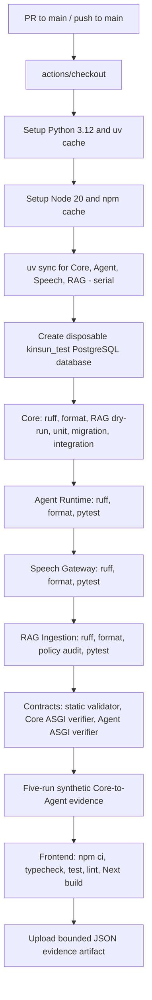
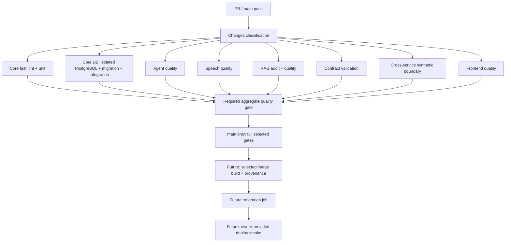

# CI Optimization Review

> Review date: 2026-09-04
> Scope: read-only review of the whole repository's CI/CD-related configuration, build inputs, tests, container definitions, deployment scripts, and documentation.
> No application code, CI configuration, or deployment setting was changed during this review.

## 1. Executive Summary

**CI Optimization Score: 38 / 100**
**Maturity: Basic**

This repository has a strong correctness-oriented Gate 1 quality gate, but its CI performance architecture is still basic. The current remote CI is a single GitHub Actions job that runs four Python services, contract checks, cross-service synthetic evidence, and the complete frontend quality/build path serially.

The three largest issues are:

1. One monolithic, serial job makes every component part of the same critical path.
2. There is no path filter, changed-files detection, or job-level conditional execution; every matching PR update and `main` push runs the currently wired Gate 1 suite.
3. Dependency-download caching exists, but there is no compiled-artifact reuse, Docker CI cache, stage timing, cache-hit reporting, or test-duration telemetry.

The repository contains one executable remote CI workflow: [`.github/workflows/gate1.yml`](.github/workflows/gate1.yml). No Jenkinsfile, Maven/Gradle project, SonarQube, CodeQL, Snyk, Trivy, Semgrep, Dependabot, or Renovate repository configuration was found.

This score measures **CI optimization maturity**, not product quality. The current CI preserves important quality and safety gates, including disposable PostgreSQL integration and migration lifecycle tests. Those gates should be isolated and scheduled intelligently, not removed merely to shorten a build.

## 2. Current Pipeline

### Trigger and workflow topology

[`gate1.yml`](.github/workflows/gate1.yml) triggers on pull requests targeting `main` and pushes to `main`. It uses one `synthetic-gate1` job on `ubuntu-latest`, with a 30-minute timeout and a pgvector/PostgreSQL service container.



All arrows above are serial because the workflow contains one job and each `run` block executes its commands sequentially.

### Actual commands and their dependencies

| Current stage | Actual work | Must wait for | Could be separated from |
|---|---|---|---|
| Python environment install | Four `uv sync --frozen --project ... --extra test --extra dev` commands | Checkout/tool setup | Frontend install and most service tests after their own setup |
| Core quality | Ruff check, Ruff format check, RAG dry-run, unit tests, migration lifecycle tests, remaining integration tests | Core environment and disposable PostgreSQL for integration | Agent, Speech, RAG, and Frontend jobs |
| Core migration lifecycle | Repeated schema drop/rebuild and Alembic upgrade/downgrade | Exclusive disposable test database | All non-DB jobs |
| Agent quality | Ruff and pytest | Agent environment | Core/Speech/RAG/Frontend |
| Speech quality | Ruff and pytest | Speech environment | Core/Agent/RAG/Frontend |
| RAG quality | Ruff, policy audit, pytest | RAG environment | Core/Agent/Speech/Frontend |
| Contract checks | Static validator and two in-process ASGI verifiers | Core/Agent environments | Speech/RAG/Frontend, subject to verifier isolation validation |
| Cross-service evidence | Starts local mock Agent HTTP process and exercises Core's adapter five times | Core and Agent environments | Core database integration; the verifier declares no Core DB writes |
| Frontend quality | `npm ci`, typecheck, Vitest, ESLint, production build | Node/npm dependencies | All Python jobs |
| Artifact upload | Uploads one JSON evidence file for 30 days | Successful five-run evidence | Nothing meaningful |

The workflow has no Docker image build, registry push, deploy, runtime migration execution, or external smoke test stage. Those capabilities are currently manual/owner-driven:

- [`scripts/build_runtime_images.ps1`](scripts/build_runtime_images.ps1) builds four local images and explicitly does **not** push them.
- [`docker-compose.yml`](docker-compose.yml) defines a local migration profile.
- [`scripts/smoke_test_deployment.py`](scripts/smoke_test_deployment.py) and [`docs/runbooks/deployment-smoke.md`](docs/runbooks/deployment-smoke.md) describe an owner-supplied external smoke test.

## 3. Critical Path

The confirmed current critical path is:

```text
Checkout
→ Tool setup/cache restore
→ Four uv sync commands
→ Disposable DB creation
→ Core quality and database integration
→ Agent quality
→ Speech quality
→ RAG quality/audit
→ Contract checks
→ Cross-service evidence
→ npm ci
→ Frontend typecheck/test/lint/build
→ Artifact upload
```

Because this is one serial job, the total wall-clock time is approximately the sum of all stages, rather than the duration of the longest independent stage.

No pipeline timing, `pytest --durations`, cache-hit rate, runner CPU/RAM, disk/network, Docker timing, or test-report data is committed to the repository. Therefore, the exact slowest stage **cannot be determined from repository evidence**. Core schema rebuild, RAG policy audit, and `next build` are plausible candidates, but they are hypotheses that need runtime metrics.

## 4. Score Breakdown

| Category | Score | Max | Evidence | Main problem |
|---|---:|---:|---|---|
| Caching | 8 | 15 | `setup-uv` has `enable-cache: true`; `setup-node` enables npm cache | Only dependency-download caching is visible; no compiled/test/Docker reuse |
| Parallelization | 2 | 15 | One `synthetic-gate1` job contains all quality commands | Independent services are serial |
| Selective Execution | 0 | 15 | No `paths`, `paths-ignore`, changed-files, matrix, or job conditions | Every matching trigger runs all wired work |
| Build Optimization | 6 | 10 | Python uses locked/frozen dependency sync; frontend uses `npm ci` | All projects sync every time; no incremental build design |
| Test Optimization | 8 | 15 | Unit, integration, migration, contract, and synthetic boundary checks exist | No timing/sharding/selective strategy; serial execution |
| Docker Optimization | 6 | 10 | Several Dockerfiles use manifest-first layers and multi-stage builds | No Docker stage in CI; no remote cache; ignore coverage incomplete |
| Artifact Reuse | 1 | 5 | One bounded JSON evidence artifact | No build artifact, test result, coverage, or image reuse |
| Pipeline Architecture | 3 | 5 | Timeout and cancellation policy exist | Monolithic workflow has no job dependency graph |
| Runner/Agent Efficiency | 2 | 5 | GitHub-hosted `ubuntu-latest` runner is declared | No sizing, queue, CPU/RAM/disk, or executor telemetry |
| Observability | 2 | 5 | Evidence records five synthetic run durations; workflow has timeout | No stage duration, cache-hit, test-duration, or summary data |

**Total: 38 / 100 — Basic**

## 5. Cache Analysis

| Cache area | Current state | Possible cache hit | Miss causes or limitations | Recommendation |
|---|---|---|---|---|
| Maven `~/.m2` | Not applicable | No Maven project files found | Not applicable | Do not add Maven cache |
| Gradle cache | Not applicable | No Gradle project files found | Not applicable | Do not add Gradle cache |
| uv package cache | Configured in CI | Unchanged lockfiles may restore package downloads | Actual cache keys/hits are not reported; virtual environments are recreated | First measure hit rate; retain package-store caching rather than prematurely caching `.venv` |
| npm cache | Configured in CI | Cached npm tarballs may be reused for unchanged lockfile | `npm ci` deliberately recreates `node_modules` every run | Keep `npm ci`; later measure `.next/cache` and ESLint cache |
| Docker layers | Dockerfiles are generally cache-friendly locally | Dependency layers can hit on a persistent Docker daemon | CI does not build images; no Buildx/GHA/registry cache import/export | Add remote Docker cache only after image CI is approved |
| Compiled outputs | Not configured | None | `.next`, Python environments, and test outputs are not reused | Measure first; cache only outputs with proven payoff |
| Test artifacts | Only JSON evidence is uploaded | Evidence can be retained for review | No JUnit, coverage, or downstream artifact reuse | Add reports and timings before caching test output |

There is no `mvn clean package` because the repository does not use Maven. No `docker build --no-cache` command was found.

### Docker cache quality by image

- Frontend Dockerfile copies manifests before application source and uses multi-stage output; this is good dependency-layer design.
- Agent Runtime and Speech Gateway use BuildKit `type=cache` mounts for uv downloads.
- Core API and Core migration images separate lockfiles from source, but do not use a BuildKit uv cache mount.
- RAG Ingestion separates lockfiles from source, but lacks both a cache mount and `.dockerignore`.

## 6. Parallelization Analysis

### Current

```text
Environment setup
↓
Core
↓
Agent
↓
Speech
↓
RAG
↓
Contracts
↓
Cross-service evidence
↓
Frontend
```

### Recommended

```text
                    ┌→ Core lint + unit
                    ├→ Core DB migration + integration
                    ├→ Agent quality
Changes classify ───┼→ Speech quality
                    ├→ RAG quality
                    ├→ Contract validation
                    ├→ Cross-service synthetic boundary
                    └→ Frontend quality
                              ↓
                       Required aggregate gate
```

### Resource constraints to preserve

| Resource | Repository evidence / risk | Safe approach |
|---|---|---|
| PostgreSQL | Migration test intentionally drops/rebuilds schemas | Dedicated disposable DB/job; keep migration and request integration ordered |
| CPU/RAM | Next build, Python tests, and PostgreSQL can contend | Prefer separate jobs over background concurrency in one workspace |
| Workspace | `.next`, pytest, Ruff, and lint caches can conflict | Let each job have its own checkout/workspace |
| Ports | Cross-service verifier starts an Agent HTTP process | It chooses a free port; separate jobs isolate further |
| Docker daemon | Docker is absent from CI today | Future image builds should be dedicated jobs |
| Test data | Database lifecycle tests are destructive by design | Never share their database with other jobs |

The existing workflow cancellation configuration is useful: it cancels stale runs for the same workflow/ref. It reduces obsolete build load, but does not shorten an individual run.

## 7. Test Strategy Analysis

The following are test-file counts, not test-case counts.

| Test type | Repository evidence | Current CI status |
|---|---|---|
| Core unit | 118 test files | Executed |
| Core integration | 18 test files | Executed |
| Agent unit/integration | 24 / 3 test files | Executed |
| RAG unit/integration | 17 / 19 test files | Executed |
| Speech boundary | 8 test files | Executed |
| Frontend Vitest | 49 test files | Executed |
| Contract | Static validator, Core ASGI verifier, Agent ASGI verifier | Executed |
| Database migration | Alembic lifecycle test | Executed |
| Cross-service | Five-run Core adapter to Agent HTTP evidence | Executed |
| Browser E2E / visual QA | Playwright scripts exist | Not in CI |
| External smoke | Script and runbook exist | Manual only |
| Security scan | No SAST/SCA/dependency scanner found | Not implemented |
| Performance/load | No executable performance pipeline found | Not implemented |

The repository's deterministic safety tests are product tests, not SAST/SCA replacements.

### Recommended test tiers

| Tier | Recommended work |
|---|---|
| PR | Changed-component lint/unit/contract checks; fast integration; always retain full Core migration gate for Core/migration/contract/policy-sensitive changes |
| Main merge | Full Gate 1, full Core DB integration, cross-service evidence, selected image build when image CI exists |
| Deploy | Immutable image verification, migration job, owner-provided endpoint smoke |
| Nightly | Browser visual QA, full regression, SAST/SCA, heavy RAG audits, future performance tests |

The current workflow runs the complete **wired Gate 1 suite** for each matching trigger, but not browser E2E, external smoke, SAST/SCA, or performance testing.

## 8. Docker Analysis

Docker is not currently part of the remote CI critical path.

| Image / file | Strengths | Gaps or future bottleneck |
|---|---|---|
| `packages/frontend/Dockerfile` | Manifest-first, multi-stage, non-root runtime | No CI image build or remote layer cache |
| `services/agent-runtime/Dockerfile` | Manifest-first, BuildKit uv cache, narrow root-context ignore file | No CI/registry cache reuse |
| `services/core-api/Dockerfile.api` | Dependency layer separate from source, multi-stage | No BuildKit dependency cache mount |
| `services/core-api/Dockerfile` | Migration image keeps dependency layer separate | No BuildKit dependency cache mount |
| `services/speech-gateway/Dockerfile` | Multi-stage, uv cache mount, non-root runtime | No service `.dockerignore` |
| `services/rag-ingestion/Dockerfile` | Lockfile copied before source | No `.dockerignore`, no cache mount, no multi-stage output |
| `services/speech-gateway/sagemaker/Dockerfile.*` | Requirement layers are separated; model revisions are pinned | Build downloads large models; cache miss will be expensive if moved into CI |

The frontend and Agent Runtime root-context Docker builds provide Dockerfile-specific ignore files. Core API has a service `.dockerignore`. However, RAG Ingestion, Speech Gateway, and SageMaker directories do not have `.dockerignore` files. If these images enter CI, their build contexts should be measured and narrowed first.

Local runtime image construction is sequential and uses ordinary `docker build`; it has no Buildx cache import/export, registry cache, push, or deployment. See [`scripts/build_runtime_images.ps1`](scripts/build_runtime_images.ps1).

Image sizes cannot be determined from repository source alone; Docker build logs or `docker image inspect` measurements are required.

## 9. Jenkins / Runner Analysis

No Jenkinsfile or Jenkins pipeline configuration exists in the repository. Jenkins-specific controls such as `agent`, executors, `stash`, `unstash`, `cleanWs`, `archiveArtifacts`, `parallel`, and `matrix` therefore cannot be reviewed.

Repository-confirmed GitHub Actions runner configuration:

- `runs-on: ubuntu-latest`
- one job
- 30-minute timeout
- one pgvector PostgreSQL service container
- no self-hosted runner labels
- no explicit checkout `fetch-depth` or `lfs` option

No `.lfsconfig`, `.gitmodules`, or LFS filter in `.gitattributes` was found. Repository configuration does not indicate Git LFS use, but actual remote/CI checkout usage should still be confirmed with `git lfs ls-files` in the real CI environment.

**需要 Jenkins Runtime Metrics 才能確認。**

The same limitation applies to GitHub-hosted runner CPU/RAM, disk throughput, network latency, queue time, and concurrent-runner availability. None should be guessed from source code.

## 10. Incremental / Selective Build Analysis

This is a monorepo, but not a Maven/Gradle multi-module build:

- Root npm workspaces are `packages/*`.
- `packages/frontend` depends on `@elderly-care/shared`.
- Each Python service has its own `pyproject.toml` and `uv.lock`.
- Core and Agent share contract/cross-service dependencies.
- Agent Runtime and RAG Ingestion share `config/rag/`.

### Conservative impact map

| Changed path | Minimum affected work |
|---|---|
| `services/core-api/**`, Core Alembic migrations | Core unit + Core DB integration + Core contract verifier |
| `services/agent-runtime/**` | Agent tests + Agent contract verifier + cross-service verifier |
| `services/speech-gateway/**` | Speech tests; Core tests too if the Core/Speech boundary changes |
| `services/rag-ingestion/**`, `config/rag/**`, RAG policy/data | RAG tests/audit + Agent retrieval tests + applicable Core RAG check |
| `packages/frontend/**`, `packages/shared/**`, root npm lock | Frontend typecheck/test/lint/build |
| `contracts/**`, contract verifier scripts | Contract checks; initially use conservative Core/Agent coverage |
| `.github/workflows/**`, shared build/verification scripts, root lockfiles | All jobs touched by the changed workflow/tooling |
| Pure `docs/**` | `git diff --check` plus future Markdown/link validation; no full service build needed |

Implementation difficulty is **Medium**. Contracts, RAG configuration, and the Core-to-Agent verifier cross module boundaries, so simple directory-based skipping is not sufficient. Use a versioned, reviewable impact map and a final aggregate job rather than workflow-level path filtering that accidentally removes a required branch-protection check.

Nx, Turborepo, Bazel, or a custom universal dependency graph are not justified at the current repository scale.

## 11. Top 10 Bottlenecks

| Priority | Problem | Repository evidence | Impact | Difficulty | Recommended fix |
|---|---|---|---|---|---|
| P0 | Single monolithic serial job | One job runs all service and frontend commands | Critical | Medium | Split into job-level dependency graph and aggregate gate |
| P0 | No selective execution | No paths/conditions/changed-files detection | High | Medium | Add conservative impact map |
| P0 | No timing/cache/test telemetry | No stage summary, cache hit output, or test duration report | High | Easy | Add job/step duration, cache, test-count, and artifact metrics |
| P1 | Core migration lifecycle blocks all later work | DB create + migration lifecycle is early in serial path | High | Medium | Keep it, but isolate it from non-DB work |
| P1 | Frontend checks are serial | `npm ci → typecheck → test → lint → build` | High | Medium | Dedicated frontend job; use separate workspaces for parallel checks |
| P1 | Four Python environments sync serially | Four `uv sync` commands in one run block | Medium | Medium | Job-level parallelism; validate cache effectiveness first |
| P1 | Whole TypeScript tree linted with no lint cache | Root ESLint command is `eslint . --ext .ts,.tsx` | Medium | Easy | Measure then persist ESLint cache metadata |
| P1 | Contracts/cross-service run after unrelated work | Contract stage follows Speech and RAG | Medium | Medium | Separate static/Agent contract and cross-service jobs |
| P2 | Local release image build has no remote cache | Sequential `docker build` script, no cache import/export | High when image CI begins | Medium | Buildx with GHA/registry cache after image CI approval |
| P2 | No SAST/SCA/browser E2E/nightly layer | No scanner config; Playwright QA not wired | High release-coverage gap | Medium | Add main/nightly gates before adding all heavy work to PRs |

## 12. Recommended Pipeline



The image/deploy/migration-release path remains a future design until hosting provider, registry, secrets, deployment owner, and production IaC are explicitly approved. The repository currently has no production IaC and should not imply otherwise.

## 13. Optimization Roadmap

### P0 — worth doing now

1. Split the current Gate 1 job into independent jobs without removing any existing test.
2. Add duration, cache-hit, test-duration, test-count, and artifact-size summaries.
3. Add a final aggregate branch-protection gate.
4. Begin a conservative changed-files impact map.

### P1 — worthwhile soon

1. Separate PR, main-merge, and nightly tiers.
2. Use measured data to decide whether `.next/cache` and ESLint cache are worthwhile.
3. Add JUnit/coverage/test-duration artifacts.
4. Select and introduce SAST/SCA as main/nightly gates.
5. Run Playwright synthetic visual QA on a nightly schedule or affected frontend paths.

### P2 — after project/deployment growth

1. Add Buildx remote cache and immutable image provenance when image CI exists.
2. Add test sharding only after per-test timing identifies a payoff.
3. Add controlled image push, migration, deploy, and smoke pipeline after owner approval.

### P3 — currently over-engineering

1. Jenkins migration.
2. Maven/Gradle caching.
3. Nx, Turborepo, Bazel, or a universal dependency graph.
4. Python virtualenv caching before measurement.
5. Registry Docker cache before Docker enters CI.
6. A full performance platform before real deployment/SLOs exist.

## 14. Expected Improvements

No CI duration data exists, so no minute-based estimate is valid.

| Area | Expected improvement | Condition |
|---|---|---|
| Developer feedback time | High | Split independent jobs |
| Narrow PR feedback | High | Correct changed-files impact map |
| Core/migration PR feedback | Medium | Core DB gate remains necessary |
| Dependency network time | Low–Medium | Existing uv/npm cache hit rates must be confirmed |
| Docker build time | None now; High later | Docker image build becomes CI work |
| Runner utilization | Medium | More jobs improve wall time but consume more runner capacity |
| Feedback-loop scalability | High | Prevent unrelated services from blocking narrow changes |

## 15. Missing Metrics

Collect the following before assigning numeric time-savings targets:

- Job and step wall-clock durations
- Queue time, runner CPU/RAM/disk/network utilization
- uv/npm cache restore/save sizes and hit rates
- PostgreSQL service image pull/start duration
- `pytest --durations` and Vitest duration data
- Test case counts, flaky-test rate, and retry rate
- Next.js build duration and `.next/cache` behavior
- Docker context size, layer-cache hit rate, image size, and registry transfer time
- Artifact size and upload/download duration
- Workflow cancellation rate
- Future smoke-test duration and failure classifications

## 16. Final Verdict

### Is the current CI healthy?

Yes, as a **correctness-oriented Gate 1 pipeline**. It uses locked dependencies, isolated PostgreSQL migration integration, contract verification, synthetic cross-service evidence, and a frontend production build.

### Is it ready to scale unchanged?

No. Its serial architecture and all-components-on-every-change behavior will lengthen feedback time roughly with the sum of services, tests, RAG assets, frontend build cost, and concurrent developer demand.

### What is the single best first optimization?

Split the existing Gate 1 workflow into independent jobs with explicit dependencies, while adding stage and cache telemetry. This preserves existing release gates and shortens the critical path caused by unrelated work.

### What is currently over-engineering?

Jenkins, Maven/Gradle cache, Nx/Turborepo/Bazel, remote Docker cache before image CI, Python virtualenv cache before data, and a full performance platform before deployment/SLOs are defined.

## Approval Candidates

The following changes are proposed only; none were made in this review:

1. Refactor `.github/workflows/gate1.yml` into parallel jobs plus an aggregate gate.
2. Add stage/cache/test-duration summaries.
3. Add a conservative changed-files impact map.
4. Add measured Frontend `.next` and ESLint caching if data supports it.
5. Add main/nightly SAST/SCA and Playwright visual QA workflows.
6. Add image build/push/migration/smoke automation only after deployment ownership and infrastructure are approved.
