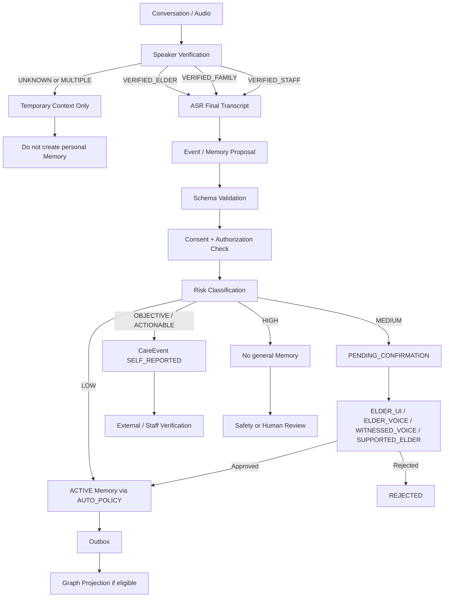
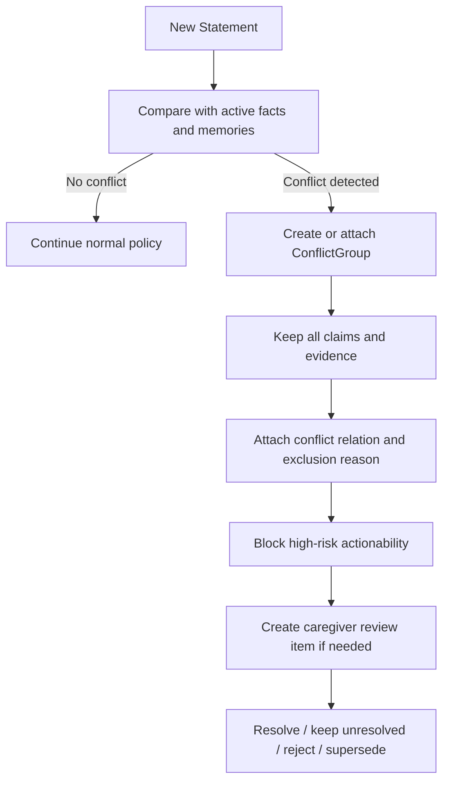
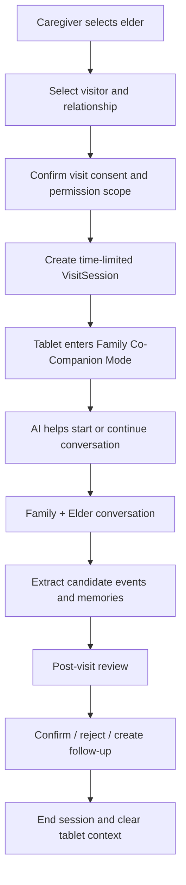

# Codex 設計任務：Evidence-aware Memory 與 Family Co-Companion

- **專案**：kinsun.ai Voice-first 智慧長照 AI 陪伴系統
- **文件用途**：交給 Codex 先理解現有程式碼，再提出可落地的設計方案
- **任務類型**：Current-state review → Gap analysis → Target design → Migration plan
- **預設原則**：先設計、後實作；未經確認不要直接大規模修改程式碼
- **版本**：Discussion Consolidation v1.1
- **日期**：2026-08-18
- **決策權威**：[ADR 0016：Evidence-aware Memory、支持式確認與 Family Co-Companion 邊界](adr/0016-evidence-aware-memory-supported-confirmation-family-visit.md)
- **文件定位**：本文件保留完整設計輸入與待辦；若與 ADR 0014／0016 衝突，以 ADR 為準，不代表 Target schema、API 或 Runtime 已實作

---

## 0A. ADR 整併後的定案邊界

本 brief 的計畫已由 ADR 0016 收斂為下列決策：

1. `ELDER_CONFIRMED` 不等於 `VERIFIED_FACT`；客觀或可行動內容仍需獨立 evidence。
2. Staff／Family 可協助與見證，但不得代替 Elder confirmation；法律代理權、資料處理同意與內容來源分開保存。
3. 失智、認知障礙、譫妄或疾病紀錄不得轉成全域 trust／capacity score，也不得由 LLM 推導。
4. 實際疾病與健康資料留在 `RestrictedCareRecord`；一般 Memory、Graph、Family context 與 Agent prompt 只取得必要的最小政策結果。
5. `DecisionSupportProfile` 依資料類別、決定範圍與有效期間採 `STANDARD`、`SUPPORTED` 或 `REPRESENTATIVE_REQUIRED`，只能收緊 ADR 0014，不能放寬 HIGH 或 Speaker Gate。
6. 第一階段沿用 `CareEvent + CareEventVersion + ReviewDecision`，不先建立通用 Claim aggregate。
7. Confirmation 採 append-only record；Conflict 採獨立 relation aggregate，不先新增 `DISPUTED`／`CONFLICTING` 核心狀態。
8. FamilyContribution 永遠保留第三方來源；未經合格 Elder confirmation 不得成為 Elder-owned ACTIVE Memory。
9. Family Visit 使用獨立短效 VisitSession capability 與 `FAMILY_VISIT` consent purpose，不重用 Staff App Session 或僅涵蓋報表的既有 grant。
10. PostgreSQL／Domain Core 是權威來源；Graph／Search 是可重建投影，所有 Context read 仍回查 Core current state。

---

## 0. 給 Codex 的直接任務

請先以**唯讀方式**檢查目前工作目錄中的實際 repository，理解既有前後端、資料庫、驗證、權限、AI workflow、Memory、CareEvent、Graph、Outbox 與照護者介面，再提出設計。

### 第一階段：只做盤點，不修改程式碼

請確認：

1. 專案實際使用的語言、框架、模組邊界與目錄結構。
2. 現有 `CareEvent`、`Memory`、`Consent`、`CareTask`、`User`、`Elder`、`Family`、`Caregiver` 等資料模型。
3. 現有 API、Service、Repository、Migration、Frontend page、Authorization 與 Audit 實作。
4. 是否已有：
   - Speaker identification / speaker verification
   - Memory candidate / confirmation flow
   - Event review status
   - Risk policy
   - Family visibility scope
   - Visit session
   - Transactional Outbox
   - Graph projection
   - Idempotency
   - Trace / audit log
5. 現在 AI 產生的資料是否會直接寫入正式資料，還是先進入候選或待覆核狀態。
6. 現有 Graph DB 是否已正式使用；若尚未使用，是否已有可替代的 relational projection。
7. 現有前端是否已有照護者長者詳情頁、事件時間軸、候選記憶確認卡與權限分流。

### 第二階段：產出設計報告

設計報告至少要包含：

1. Current-state architecture map。
2. 現況與本文件需求的 Gap matrix。
3. 建議的 Target domain model。
4. State machine 與 workflow。
5. Schema / migration proposal。
6. API contract proposal。
7. Frontend flow 與頁面變更。
8. Authorization、Consent、Privacy 與 Audit 設計。
9. Graph projection 與一致性策略。
10. Test matrix、Golden cases 與 failure cases。
11. 分階段 implementation plan。
12. 受影響檔案與模組清單。
13. 風險、取捨與仍需產品決策的問題。

### Codex 執行限制

- 不要假設本文件中的類別名稱一定已存在，必須先映射到實際程式碼。
- 不要為了符合文件而重建整套系統；優先延伸現有 `CareEvent` 與 `Memory` 架構。
- 不要只靠 Prompt 實作權限、安全、同意、日期、狀態轉換或寫入限制。
- 不要讓 LLM 直接決定正式資料狀態。
- 不要把 Graph DB 當成交易主資料庫。
- 不要在第一階段直接改 schema、產生 migration 或修改大量檔案。
- 如果現有實作與本文件衝突，要明確列出，不可靜默覆蓋。

---

# 1. 本次調整的背景

最初構想是：家屬來會客時，照護員在平板設定來訪家屬，讓家屬查看或詢問長者資料。

討論後發現，這種設計有三個主要問題：

1. **家屬人在長者旁邊時，AI 不應搶著替長者回答。**
   - 例如家屬問「媽媽最近有沒有想吃什麼」，正常情況應先直接問長者本人。
   - AI 應促進互動，而不是讓家屬繞過長者查資料。

2. **長者說過的內容不一定等於客觀事實。**
   - 特別是失智、譫妄、認知狀況波動、時間感混淆或多人同時說話時。
   - 「長者已確認」也不必然等於「外部世界已驗證」。

3. **不能因為長者有失智症，就把所有陳述全面視為不可信。**
   - 長者仍可決定自己的稱呼、偏好、想不想保存某段回憶、是否接受 AI 主動陪伴。
   - 系統應判斷「資料的證據狀態與使用風險」，而不是診斷「這個人是否可信」。

因此新的產品方向是：

> AI 不替長者發言，也不把單次陳述直接當成客觀事實；AI 記錄「誰在什麼時間、根據什麼來源說了什麼」，再依風險、來源、衝突與確認方式，決定它可以被如何使用。

---

# 2. 新版產品定位

本次新增或強化三個相互連接的能力：

1. **Evidence-aware Memory｜證據感知記憶**
2. **Caregiver Review｜照護者覆核閉環**
3. **Family Co-Companion｜家庭共伴會客模式**

新版定位：

> kinsun.ai 不是替家屬監看長者，也不是替長者說話；它是一套能分辨陳述、事件、記憶與可驗證事實，協助長者、家屬及照護者共同建立可信生活脈絡的 AI 共伴系統。

---

# 3. 必須遵守的核心原則

## 3.1 Confirmed Memory 不等於 Verified Fact

以下概念必須分開：

- **Reported Statement**：某個人在某個時間說過什麼。
- **CareEvent**：從陳述、裝置或人工操作形成的生活事件紀錄。
- **Memory Candidate**：可能適合未來個人化對話使用的候選資訊。
- **Confirmed Memory**：已依政策完成必要確認、可供未來對話引用的個人脈絡。
- **Verified Fact**：有足夠外部證據，可供正式照護工作流或客觀紀錄使用的事實。

範例：

```text
長者：「我今天已經吃過藥。」
```

可以建立：

```text
MEDICATION_REPORTED
speaker = ELDER
verification_status = SELF_REPORTED
```

不可直接建立：

```text
MEDICATION_TAKEN_VERIFIED
```

## 3.2 AI 評估資料，不診斷長者

禁止讓 AI 產生或維護下列類似狀態：

```text
elder_is_confused = true
elder_trust_score = 0.25
elder_lacks_capacity = true
```

允許維護：

```text
conflict_group_id = <reference>
conflict_resolution_status = OPEN
source_count = 1
verification_required = STAFF_OR_EXTERNAL
risk_level = HIGH
```

系統只能判斷資料是否：

- 單一來源。
- 缺乏證據。
- 與其他資料衝突。
- 涉及高風險行動。
- 需要人工或外部驗證。

## 3.3 保留長者自主權

即使長者有失智症或認知狀況波動，仍應盡量保留其對以下事項的決定權：

- 希望被如何稱呼。
- 喜歡的音樂、話題與回覆長度。
- 是否願意保存某段人生故事。
- 是否願意讓家屬收到摘要。
- 是否同意 AI 主動發起互動。
- 是否願意繼續、停止、換題或稍後再聊。

高風險、客觀或可執行內容則需提高確認門檻。

## 3.4 家屬是 Contributor，不是 Authority

家屬可以：

- 補充人生故事。
- 提供家庭關係資訊。
- 提供候選事件或候選記憶。
- 參與見證式確認。

家屬不能直接：

- 建立正式長期記憶。
- 把用藥或醫療內容標記為已驗證。
- 任意修改或刪除長者已確認記憶。
- 查看完整逐字稿、量表原始回答或敏感陪伴需求分析。

## 3.5 衝突時不自動覆寫

若長者前後說法不同：

- 保留各筆陳述及其來源。
- 建立 `conflict_group_id` 或等價關聯。
- 不由 AI 判斷哪一筆必然正確。
- 未解決前不得驅動高風險行動。
- 對長者回應時不使用責備或「抓錯」方式。

## 3.6 RDS 是交易事實來源

- 同意、權限、正式狀態、記憶確認、事件覆核、VisitSession 與 Audit 由 relational database 保存。
- Graph DB 只保存可重建的關係投影。
- 未確認、衝突或已停用資料不得成為 active graph relationship。
- RDS → Graph 使用 Outbox、idempotency、retry 與 dead-letter strategy。

---

# 4. 與既有 v1.3 規格的關係

本文件不是重建產品，而是對既有需求的補強與部分修訂。

## 4.1 保留的既有原則

- 語音優先。
- 人機協作。
- 重要資訊確認後才成為長期記憶。
- 摘要、事件與記憶可追溯。
- 不提供醫療診斷、停藥、改藥或治療決策。
- 家屬不查看完整逐字稿。
- 家屬通知需有同意與照護者確認。
- `elder_id`、`tenant_id` 與角色權限隔離。
- 只有確認資料可進入正式 Graph projection。

## 4.2 本次明確提出的需求修訂

目前討論採用：

- 長者已明確開啟「低風險個人化記憶」後，**LOW risk** 的穩定偏好可依 deterministic policy 自動建立 `ACTIVE` Memory。
- **MEDIUM risk** 仍需逐筆確認。
- **HIGH risk** 不建立一般長期 Memory。

這代表它會修訂既有「每筆重要記憶都先詢問」的嚴格版本。Codex 必須：

1. 把這項差異列為明確 ADR 或 product decision。
2. 找出受影響的 user story、test、UI 與資料欄位。
3. 不得把所有資料都視為 LOW risk。
4. 長者撤回長期記憶同意後，停止建立新的自動記憶。

---

# 5. 目標 Domain Terminology

Codex 應先確認現有程式碼是否已有對應概念，再決定延伸既有模型或新增資料表。

| 名稱 | 定義 |
|---|---|
| `ReportedStatement` | 某個 speaker 在某時間說過的內容；可映射為 CareEvent evidence，不一定需要獨立表 |
| `CareEvent` | 生活、社交、用藥陳述、活動或會客等事件紀錄 |
| `MemoryCandidate` | 可供未來對話使用、但尚未完成必要確認的候選記憶 |
| `Memory` | 可被檢索及用於個人化回應的長期記憶 |
| `Evidence` | 支撐某個 Event、Claim 或 Memory 的來源 |
| `Confirmation` | 誰以哪種方式確認何種內容 |
| `ConflictGroup` | 多筆互相矛盾或需共同覆核的陳述集合 |
| `DecisionSupportProfile` | 依 decision scope、資料類別與有效期間決定確認支持方式的最小政策；不是診斷或 trust score |
| `VisitSession` | 限時、限長者、限家屬、限權限的家庭會客 Session |
| `FamilyContribution` | 家屬提供的候選事件或候選記憶，不是正式事實 |
| `CareTask` | 需要照護者確認、聯繫或追蹤的正式工作項目 |
| `GraphProjection` | 從 RDS 投影出的 active 人物、事件、偏好與關係 |

---

# 6. 核心工作流

## 6.1 一般語音對話與記憶工作流



## 6.2 衝突處理流程



## 6.3 家庭共伴會客流程



---

# 7. Speaker Verification 設計要求

至少需要以下語意狀態；實際 enum 名稱可依現有程式碼風格調整：

```text
VERIFIED_ELDER
VERIFIED_FAMILY
VERIFIED_STAFF
UNKNOWN
MULTIPLE
```

## 7.1 最低規則

1. `UNKNOWN` 或 `MULTIPLE` 不得直接建立個人長期 Memory。
2. Family Visit Session 中，家屬身分應優先由照護員建立 Session 時決定，不要只靠聲紋模型猜測。
3. Speaker model 可以作為輔助訊號，不是高風險資料的唯一身份依據。
4. 每筆 Event / Memory Proposal 要保留：
   - `speaker_role`
   - `speaker_id`（若可確認）
   - `speaker_verification_status`
   - `speaker_verification_method`
   - `session_id`
5. 多人同時說話時，允許保存會話級暫存內容，但不可錯綁到某位長者的正式 Memory。

---

# 8. Memory Risk Policy

Codex 應將此政策實作為版本化、可測試的 deterministic policy，而不是只寫在 Prompt。

## 8.1 LOW｜低風險個人化資訊

範例：

- 喜歡聽老歌。
- 希望被稱為阿嬤。
- 回答不要太長。
- 喜歡聊天的時間。
- 不喜歡某類非敏感話題。

處理：

- 前提：已有有效的長期記憶總體同意。
- 可自動建立 `ACTIVE` Memory。
- `confirmation_method = AUTO_POLICY`。
- 必須保存 conversation／turn／session 或真實 CareEvent 的 source reference、policy version 與 reason code；不得為 LOW 偏好製造假的 CareEvent。
- 長者可查看、更正、停用及刪除。

## 8.2 MEDIUM｜重要關係、固定習慣與人生故事

範例：

- 女兒叫小美。
- 以前住在彰化。
- 每年過年會做蘿蔔糕。
- 每週日習慣等女兒打電話。

處理：

- 建立 `PENDING_CONFIRMATION`。
- 支援確認方式：
  - `ELDER_UI`
  - `ELDER_VOICE`
  - `WITNESSED_VOICE`
  - `SUPPORTED_ELDER_CONFIRMATION`
- 只有 Elder 對固定版本完成合格確認後，才能成為 `ACTIVE` Memory；Staff／Family 只可協助與見證。
- Elder confirmation 不等於客觀事實已驗證。
- 若與既有資料衝突，加入 `ConflictGroup` 並由 retrieval／actionability Gate 阻擋；第一階段不新增 `DISPUTED` 或 `CONFLICTING` 核心狀態。

## 8.3 OBJECTIVE / ACTIONABLE｜客觀或會驅動工作流的資訊

範例：

- 女兒今天是否真的來訪。
- 今天是否真的服藥。
- 明天是否有門診。
- 活動是否已完成。
- 家屬是否答應某個時間來接人。

處理：

- 長者陳述只能先成為 `SELF_REPORTED` CareEvent。
- 不得只靠 Self Confirmation 升級成外部已驗證事實。
- 需由照護員、Family Visit Session、系統紀錄、正式排程或其他外部 evidence 驗證。
- 在未驗證前不得驅動高風險提醒、用藥結論或正式照護紀錄。

## 8.4 HIGH｜醫療、財務、法律、重大安全與敏感衝突

範例：

- 醫生叫我停藥。
- 我要把錢全部轉給某人。
- 某位家屬虐待我。
- 明確跌倒、無法求助或即刻危險。
- AI 推測的疾病、認知能力或精神狀態。

處理：

- 不建立一般長期 Memory。
- 保存必要的 CareEvent 與 evidence。
- 進入固定安全規則、人工覆核或緊急分流。
- AI 不做診斷、不做真偽裁定、不自動通知所有家屬。

---

# 9. Decision Support Profile

不要使用「整位長者可信／不可信」的二元設定。

應支援依資料類別設定確認方式，例如：

```yaml
decision_support_profile:
  personal_preference:
    mode: SELF_OR_AUTO_POLICY
  life_story:
    mode: SELF_CONFIRM
    support_mode: SUPPORTED_ELDER_CONFIRMATION
    conflict_fallback: CAREGIVER_REVIEW
  family_relationship:
    mode: SELF_CONFIRM
    conflict_fallback: CAREGIVER_REVIEW
  schedule_and_visit:
    mode: EXTERNAL_VERIFICATION
  medication:
    mode: HUMAN_REVIEW_ONLY
  medical_fact:
    mode: HUMAN_REVIEW_ONLY
  finance_and_legal:
    mode: HUMAN_REVIEW_ONLY
```

## 設計要求

- Profile 必須版本化。
- 每次決策保存使用的 `policy_version` / `profile_version`。
- Profile 不是診斷紀錄。
- Profile 不保存全域 trust／capacity score；疾病原文只留在 restricted care record，以不透明 reference 關聯。
- Profile 依 decision scope、data class 與有效期間設定 `STANDARD`、`SUPPORTED` 或 `REPRESENTATIVE_REQUIRED`。
- `SUPPORTED` 仍由 Elder 作成決定；Staff／Family 不能代答。
- Profile 修改需有權限與 audit。
- 若未設定，採最保守的預設政策。

---

# 10. 衝突資料的處理

## 10.1 範例

星期一，長者說：

> 小美昨天有來看我。

星期二，長者說：

> 小美好久都沒有來了。

系統應保留：

```text
Claim A
content = 小美昨天來過
speaker = ELDER
status = SELF_REPORTED

Claim B
content = 小美很久沒來
speaker = ELDER
status = SELF_REPORTED

conflict_group_id = same_group
```

## 10.2 不可做的事

- 不可直接刪除其中一筆。
- 不可讓 LLM 自行選一個「比較像真的」。
- 不可對長者說「妳昨天明明不是這樣講」。
- 不可直接把衝突解讀成失智惡化。

## 10.3 可做的事

- 後台顯示「近期家庭互動資訊存在不一致」。
- 對長者回應當下感受，例如「妳最近好像很想小美」。
- 若有實際 VisitSession，建立 `STAFF_VERIFIED` 或 `SYSTEM_VERIFIED` visit event。
- 即使有客觀會客紀錄，也保留長者「很久沒來」的感受性陳述，因兩者表達的資訊不同。

---

# 11. Family Co-Companion｜家庭共伴會客模式

## 11.1 產品目標

AI 的任務是：

1. 幫忙開始話題。
2. 延續上次家庭互動。
3. 支援共同回憶。
4. 整理候選事件與候選記憶。
5. 建立經確認的下次追蹤。

AI 的任務不是：

- 替長者回答所有問題。
- 提供家屬一個可任意查詢長者隱私的聊天入口。
- 讓家屬修改正式照護資料。
- 在長者面前揭露敏感分析、逐字稿或陪伴需求分數。

## 11.2 回答優先順序

家屬問：

> 媽媽最近有沒有想吃什麼？

在長者本人就在旁邊且可以互動時，AI 預設應先回：

> 阿嬤就在這裡，我們先問問她今天最想吃什麼？

只有在以下條件成立時，AI 才可補充 shareable context：

- 長者明確允許 AI 協助。
- 問題不是長者此刻可直接回答的內容。
- 使用的資料是 `FAMILY_SHAREABLE`。
- 不包含完整逐字稿、敏感健康推測或未覆核訊號。

## 11.3 VisitSession 最低欄位

```text
session_id
elder_id
tenant_id
visitor_id
visitor_role
relationship
started_by_staff_id
started_at
expires_at
ended_at
consent_version
permission_scope
status
created_at
updated_at
```

建議狀態：

```text
CREATED
ACTIVE
ENDED
EXPIRED
CANCELLED
```

## 11.4 VisitSession 安全規則

- Session 必須限時。
- Session token 僅能存取指定 `elder_id`。
- 必須有明確結束按鈕與剩餘時間提示。
- Session 結束或到期後清除平板 Context、Cache 與本地敏感狀態。
- 下一位使用者不可看到上一位長者或家屬資料。
- 不得以 Prompt 作為資料隔離機制。
- 後端必須重新驗證 VisitSession、permission scope 與 elder ownership。

## 11.5 Family Contribution

家屬說：

> 媽媽以前每年過年都會做蘿蔔糕。

系統只能先建立：

```text
FamilyContribution / MemoryCandidate
source = FAMILY_VISIT
speaker = VERIFIED_FAMILY
status = PENDING_CONFIRMATION
```

確認後才可成為：

```text
Memory
status = ACTIVE
confirmed_by = ELDER
confirmation_method = ELDER_UI / ELDER_VOICE / WITNESSED_VOICE / SUPPORTED_ELDER_CONFIRMATION
```

若 Elder 無法完成本次確認，內容維持 `FamilyContribution`／conflict evidence 或正式照護紀錄；代表人即使具有經核驗的資料處理權限，其陳述也不得改標為 `ELDER_CONFIRMED`。

## 11.6 會客後整理

會客結束後可產生：

- 本次共同話題。
- 候選生活事件。
- 候選家庭記憶。
- 待確認的家庭關係或故事。
- 下次想做的活動。
- `follow_up_plan`。
- 不含完整逐字稿的會客摘要。

所有候選資料仍需通過同意、風險、來源與確認政策。

---

# 12. Visibility Scope

建議支援至少以下資料可見範圍：

```text
PRIVATE_ELDER
CARE_TEAM
FAMILY_SHAREABLE
SPECIFIC_FAMILY_MEMBER
SYSTEM_INTERNAL
```

## 基本權限矩陣

| 資料 | 長者 | 照護者 | 家屬會客 |
|---|---:|---:|---:|
| 基本資料 | 自己 | 權限內 | 部分 |
| 今日生活摘要 | 可看 | 可看 | 僅 shareable 版本 |
| 最近活動 | 可看 | 可看 | 僅 shareable 版本 |
| 完整逐字稿 | 依政策 | 權限內且有必要 | 不可看 |
| 用藥詳細事件 | 依政策 | 權限內 | 預設不可看 |
| 陪伴需求訊號 | 不以診斷呈現 | 可覆核 | 不可看 |
| 已確認家庭記憶 | 可看 | 權限內 | 僅允許分享部分 |
| 修改事件 | 不適用或有限 | 可覆核 | 不可 |
| 提供候選資訊 | 可 | 可 | 可 |
| 建立正式 Memory | 依政策確認 | 授權範圍內 | 不可直接建立 |

---

# 13. 建議資料模型變更

以下是設計方向，不代表一定新增全部資料表。Codex 必須先檢查現有模型並提出最小改動方案。

## 13.1 `care_event` 建議增加

```text
speaker_role
speaker_id
speaker_verification_status
speaker_verification_method
source_type
source_id
verification_status
verification_method
verified_by
verified_at
risk_level
visibility_scope
actionability
conflict_group_id
policy_version
trace_id
```

可能的 `verification_status`：

```text
UNVERIFIED
SELF_REPORTED
SELF_CONFIRMED
WITNESSED_ELDER
FAMILY_REPORTED
STAFF_VERIFIED
SYSTEM_VERIFIED
REJECTED
```

## 13.2 `memory` 建議增加

```text
risk_level
source_reference
source_type
speaker_role
confirmation_method
confirmed_by
confirmed_at
policy_version
valid_from
valid_to
visibility_scope
status
supersedes_memory_id
conflict_group_id
```

可能的 `status`：

```text
CANDIDATE
PENDING_CONFIRMATION
ACTIVE
INACTIVE
DELETED
REJECTED
```

## 13.3 可考慮新增的輔助資料表

依現況決定是否需要：

```text
memory_confirmation
evidence_record
conflict_group
conflict_member
conflict_resolution
decision_support_profile
legal_authority
visit_session
visit_session_participant
outbox_event
```

避免建立沒有明確 ownership 的重複資料表。

## 13.4 資料不可變與稽核

- 原始 evidence 不應被直接覆寫。
- 修正要保存 before / after、actor、reason、timestamp。
- Memory 更新可考慮 version 或 supersede，而不是無痕原地修改。
- 刪除需同步處理主資料、Graph projection、search index 與 derived data。

---

# 14. 建議 State Machines

## 14.1 Memory

```text
CANDIDATE
  → PENDING_CONFIRMATION
  → ACTIVE
  → INACTIVE
  → DELETED

CANDIDATE → REJECTED
PENDING_CONFIRMATION → REJECTED
```

Conflict 由 `ConflictGroup + ConflictMember + ConflictResolution` 與 retrieval／actionability exclusion 表達，不先擴張 Memory 核心 state。

## 14.2 CareEvent Verification

```text
UNVERIFIED
  → SELF_REPORTED
  → STAFF_VERIFIED / SYSTEM_VERIFIED / WITNESSED
  → REJECTED
```

互相矛盾的 Event 仍保留原狀態與 evidence，另加入 ConflictGroup；不得把衝突當成單筆 Event 的真偽裁定。

實際 transition 應依 domain invariant 調整，不能讓任意 API 直接跳狀態。

## 14.3 VisitSession

```text
CREATED → ACTIVE → ENDED
CREATED → CANCELLED
ACTIVE → EXPIRED
ACTIVE → CANCELLED
```

到期後不可恢復同一 Session；需重新建立並重新檢查權限與同意。

---

# 15. API 設計方向

以下 route 只是語意範例，Codex 應配合現有 API style、versioning 與 resource naming。

## 15.1 VisitSession

```http
POST   /visit-sessions
GET    /visit-sessions/{sessionId}
POST   /visit-sessions/{sessionId}/activate
POST   /visit-sessions/{sessionId}/end
POST   /visit-sessions/{sessionId}/cancel
GET    /visit-sessions/{sessionId}/shareable-context
```

## 15.2 Memory Candidate / Confirmation

```http
GET    /elders/{elderId}/memory-candidates
POST   /memory-candidates/{candidateId}/confirm
POST   /memory-candidates/{candidateId}/reject
POST   /memories/{memoryId}/deactivate
DELETE /memories/{memoryId}
```

確認 request 應包含：

```json
{
  "confirmationMethod": "ELDER_VOICE",
  "expectedVersion": 3,
  "idempotencyKey": "..."
}
```

## 15.3 Event Verification / Conflict

```http
POST /care-events/{eventId}/verify
POST /care-events/{eventId}/reject
GET  /elders/{elderId}/conflicts
POST /conflicts/{conflictId}/resolve
```

## 15.4 API 必要要求

- Authentication。
- `elder_id` / `tenant_id` ownership check。
- Role and field-level authorization。
- Strict schema validation。
- Expected version / optimistic locking。
- Idempotency key。
- Audit event。
- Trace ID。
- Stable error taxonomy。

---

# 16. 前端設計要求

## 16.1 照護者端

至少需要：

1. **候選記憶卡**
   - 內容。
   - 說話者。
   - 來源句或 evidence 摘要。
   - 風險。
   - 建議確認方式。
   - 確認、修正、拒絕。

2. **衝突資訊卡**
   - 各筆 claim。
   - 時間與來源。
   - 目前 verification status。
   - 可選處理方式。
   - 不顯示「長者說謊」或診斷式文案。

3. **Confirmation Profile 設定**
   - 依類別設定。
   - 顯示變更者與版本。
   - 高風險設定需較高權限。

4. **VisitSession 建立頁**
   - 選長者。
   - 選家屬與關係。
   - 選權限範圍。
   - 顯示到期時間。
   - 確認本次同意。

## 16.2 家庭共伴平板

至少需要：

- 清楚顯示目前長者與來訪家屬。
- 顯示「家庭共伴模式」而不是一般後台。
- 顯示剩餘時間。
- 明顯的結束按鈕。
- AI 話題卡：延續上次、看照片、家庭故事、地方回憶、簡單活動。
- 長者可說停止、換題、不要記住。
- 不顯示完整逐字稿、風險分數、陪伴需求分析或內部 evidence metadata。
- Session 結束後立即返回乾淨的登入／待機畫面。

---

# 17. Graph DB 與投影規則

只有符合以下條件的資料才可進 active Graph projection：

- `Memory.status = ACTIVE`。
- 已確認人物或關係。
- 已覆核或正式驗證的 Event。
- 同一 `tenant_id` / `elder_id`。
- 未被撤回、停用、刪除或失效。

每個 node / edge 至少需保留：

```text
elder_id
tenant_id
source_id
source_type
status
valid_from
valid_to
version
```

禁止：

- 將 `SELF_REPORTED` 直接投影為 verified relationship。
- 將 family contribution 未確認內容投影為 active memory edge。
- RDS 與 Graph 無保護雙寫。

一致性建議：

```text
RDS transaction
  → Outbox event
  → Projection worker
  → Graph upsert with idempotency key
  → retry / DLQ
```

---

# 18. Consent、Privacy 與安全要求

## 18.1 Consent

至少區分：

- 錄音與逐字稿。
- 長期記憶。
- 低風險自動個人化記憶。
- 家屬分享。
- 家庭共伴會客。
- 陪伴需求分析。
- 主動陪伴。

撤回後：

- 立即停止新增對應分析或記憶。
- 既有資料依 retention / deletion policy 處理。
- 不得繼續從 Graph 或 search index 取用已失效資料。

## 18.2 Authorization

- 後端 enforcement 優先於前端隱藏。
- 每筆資料依 `tenant_id`、`elder_id`、role、visibility scope 檢查。
- Family Visit token 不能呼叫一般照護者 API。
- 防止 IDOR、跨長者搜尋、報表洩漏與 Prompt injection 取得未授權資料。

## 18.3 Logging

應記錄：

- `trace_id`
- actor
- elder / tenant scope
- policy version
- speaker verification result
- risk decision
- confirmation method
- state transition
- blocked reason

不應在一般 log 直接保存：

- 完整敏感逐字稿。
- 完整醫療或家庭衝突內容。
- Session token。
- 未遮罩的個資。

---

# 19. 必須覆蓋的 Acceptance / Test Cases

Codex 的設計與後續實作至少要覆蓋以下案例。

## 19.1 Memory Policy

1. 已同意低風險記憶，長者說「我喜歡聽老歌」：建立 `ACTIVE + AUTO_POLICY`。
2. 未同意長期記憶，同一句話：不得建立 Memory。
3. 中風險人生故事：建立 `PENDING_CONFIRMATION`，不可直接 active。
4. 長者拒絕候選記憶：狀態為 rejected，後續不可檢索。
5. 高風險停藥陳述：不建立一般 Memory，進安全或人工流程。

## 19.2 Speaker

6. `UNKNOWN` speaker：不得綁定個人 Memory。
7. `MULTIPLE` speaker：不得將整段對話寫成長者正式記憶。
8. Family Visit 中已由照護員設定家屬：Family contribution 保留正確 speaker identity。

## 19.3 Evidence / Verification

9. 長者說已服藥：只能建立 self-reported event，不是 verified medication fact。
10. 照護員確認實際來訪：可建立 staff-verified visit event。
11. Family contribution 不可直接成為 active memory。

## 19.4 Conflict

12. 前後陳述矛盾：兩筆都保留並建立 conflict group。
13. 未解決衝突不得驅動高風險提醒。
14. AI 對長者回應不得責備或宣稱其認知惡化。

## 19.5 Family Co-Companion

15. 家屬問「媽媽最近想吃什麼」，長者在場且可互動：AI 優先把問題交還長者。
16. Session 僅能存取 `FAMILY_SHAREABLE` context。
17. Session 到期後 API 拒絕存取。
18. 結束 Session 後平板不殘留上一位長者資料。
19. 下一位訪客不可讀取前一 Session 的內容。
20. 家屬提供故事後，需經長者或授權方式確認才能 active。

## 19.6 Security / Reliability

21. 跨 `elder_id` 直接存取應回傳 forbidden / not found，不洩漏存在性。
22. 同一 confirmation request 重送不產生重複 Memory。
23. Memory active 後 Outbox 重放不產生重複 Graph edge。
24. 撤回同意後不再建立新的 auto memory。
25. 刪除 Memory 後，Graph 與 search index 不再可取用。
26. Stale version confirmation 被 optimistic locking 阻擋。
27. LLM 回傳不符合 Schema 時最多修正一次，再安全降級。

---

# 20. 建議實作波次

## Phase 0｜Current-state Audit

- 盤點 domain、schema、API、UI、workflow、Auth 與 Graph。
- 產出 Gap matrix。
- 已建立 ADR 0016：`Evidence-aware Memory、支持式確認與 Family Co-Companion 邊界`。
- 明確標出 v1.3 被修訂的需求。

## Phase 1｜Evidence-aware Memory Core

優先完成：

- Speaker verification status。
- CareEvent source / verification 欄位。
- Memory risk policy。
- LOW / MEDIUM / HIGH 分流。
- `SELF_REPORTED` 與 `VERIFIED` 分離。
- Unknown / Multiple speaker 阻擋個人 Memory。
- Schema validation、idempotency、audit。

## Phase 2｜Caregiver Review Loop

- 候選記憶確認。
- 衝突卡與 conflict workflow。
- Confirmation Profile。
- DecisionSupportProfile 與 RestrictedCareRecord 的最小政策 reference。
- 修正、拒絕、停用與刪除。
- Outbox / Graph projection consistency。

## Phase 3｜Family Co-Companion

- VisitSession domain 與 API。
- `FAMILY_VISIT` consent purpose 與獨立短效 capability。
- 家屬／長者共同平板頁面。
- Shareable context filter。
- Family contribution。
- 會客後整理。
- Session expiry / clear context。

## Phase 4｜Enhancement

- 家庭共同回憶時間軸。
- 照片、歌曲、地方故事。
- 更完整 Graph relation query。
- 跨日 follow-up。
- 回饋與 personalization evaluation。

---

# 21. Migration 要求

Codex 應提出 backward-compatible migration，而不是一次破壞式重建。

至少說明：

1. 新欄位是否可先 nullable。
2. 舊資料如何 backfill。
3. 無法判斷來源的舊 Memory 應標記為何種狀態。
4. 舊 API 與新欄位的 reader compatibility。
5. 新版 writer 上線前，舊版程式是否仍能讀取。
6. Graph projection 如何重建。
7. Rollback 時資料格式是否仍相容。
8. 是否需要 feature flag：
   - `evidence_aware_memory`
   - `auto_low_risk_memory`
   - `family_visit_mode`
9. Migration、backfill 與 projection replay 的驗證方式。

建議保守預設：

- 無來源的舊 Memory 不自動升級為 verified fact。
- 不確定的舊資料標記為 legacy / needs review，而不是偽造 confirmation metadata。

---

# 22. Codex 最終輸出格式

請依下列章節回覆，先不要直接實作：

```markdown
# Current-State Findings

## Repository Structure
## Existing Domain Models
## Existing Workflows
## Existing Authorization and Consent
## Existing Graph / Outbox / Audit

# Gap Matrix

| Requirement | Current State | Gap | Risk | Recommended Change |

# Proposed Target Design

## Domain Model
## State Machines
## Memory Policy
## Speaker Verification
## Conflict Handling
## Family Visit Session
## Authorization
## Graph Projection

# Schema and Migration Proposal

# API Proposal

# Frontend Proposal

# Test Matrix

# File / Module Impact Map

| Module or File | Proposed Change | Reason | Risk |

# Implementation Phases

# Risks and Trade-offs

# Open Product Decisions
```

## Codex 應特別回答的問題

1. 現有 `CareEvent` 是否足以承載 Reported Statement，還是需新增 Claim entity？
2. Confirmation 應放在 Memory 欄位、獨立 table，還是 audit event？
3. Conflict 應以 relation table、group id 還是 domain aggregate 實作？
4. 現有 Auth 能否支援 VisitSession 的臨時 scope token？
5. Family shareable view 應在 query 層、service 層或獨立 read model 實作？
6. 現有 Graph sync 是否支援撤回、停用、刪除與 replay？
7. LOW risk auto memory 是否會與現有 US-D02 流程衝突，需修改哪些頁面與測試？
8. 如何避免 family contribution、ASR 誤判或多人說話污染長期記憶？
9. 最小可交付 vertical slice 是什麼？
10. 哪些功能可以先不做而不破壞核心安全性？

---

# 23. Definition of Done

本次設計只有在以下條件成立時才算完成：

- Codex 已依實際 repository，而不是只依本文件猜測。
- Current-state 與 Target-state 有清楚差異。
- 不重建整套 CareEvent / Memory，除非有充分證據證明現有結構無法延伸。
- Confirmed Memory、Reported Event 與 Verified Fact 已明確分離。
- Unknown / Multiple speaker 無法污染個人 Memory。
- LOW / MEDIUM / HIGH policy 可版本化、可測試、可稽核。
- 失智或認知波動不被簡化成全域 trust score。
- 疾病與健康原文不進一般 Memory、Graph、Family context 或 Agent prompt；DecisionSupportProfile 只保存最小政策資訊與 restricted reference。
- `SUPPORTED` confirmation 仍由 Elder 作成決定；代理權、同意 authority、witness 與 content provenance 已分離。
- 家屬無法直接修改正式記憶或存取完整敏感資料。
- Family Visit Session 有限時、scope、consent、expiry 與 context cleanup。
- Conflict 不會被無痕覆寫。
- 高風險寫入與通知無法繞過 deterministic guard 與人工確認。
- RDS 與 Graph 的新增、更正、停用、撤回及刪除具有一致性策略。
- Migration、rollback、idempotency、audit 與 test plan 都已說明。

---

# 24. 建議先閱讀的專案文件

Codex 在 repository 或專案 context 可取得時，請先閱讀：

1. `智慧長照 AI 陪伴系統－使用者故事與驗收條件 v1.3`
2. `03智慧長照 AI 陪伴系統－Story Map v1.0`
3. `完整專案設計流程_從想法到上線營運.md`
4. 現有架構文件、ADR、database migration、API contract 與 README
5. 現有 CareEvent、Memory、Consent、Graph、Outbox 與 Authorization 程式碼

如文件與實際程式碼不一致，請同時列出：

- 文件預期。
- 程式碼現況。
- 建議以哪一方為準。
- 所需 migration 或規格修訂。
